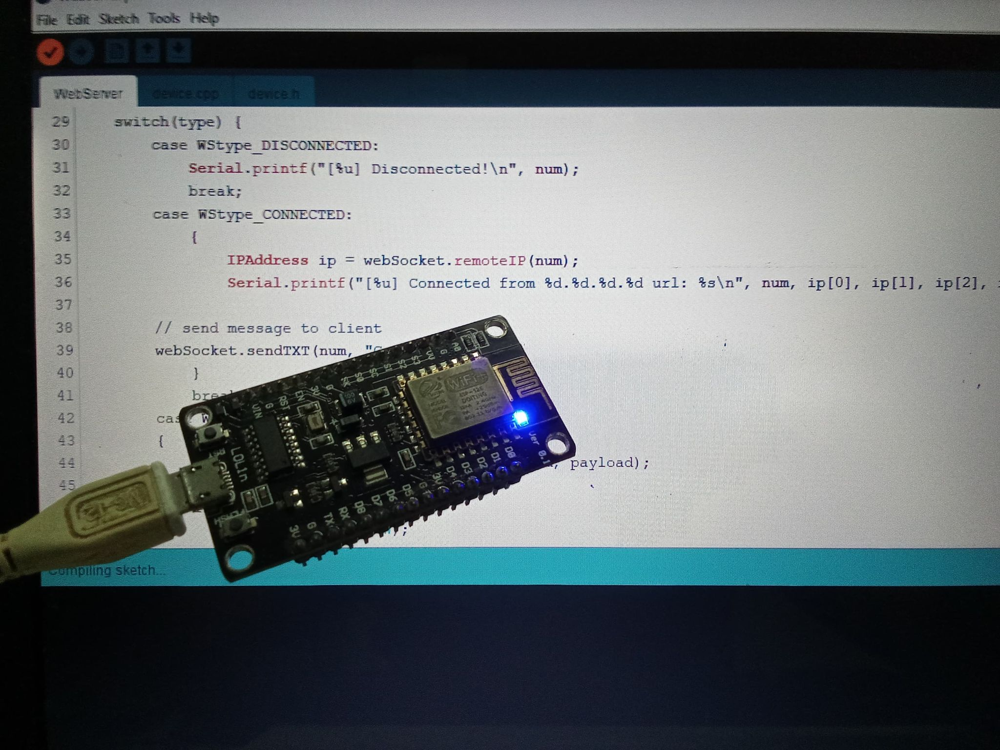
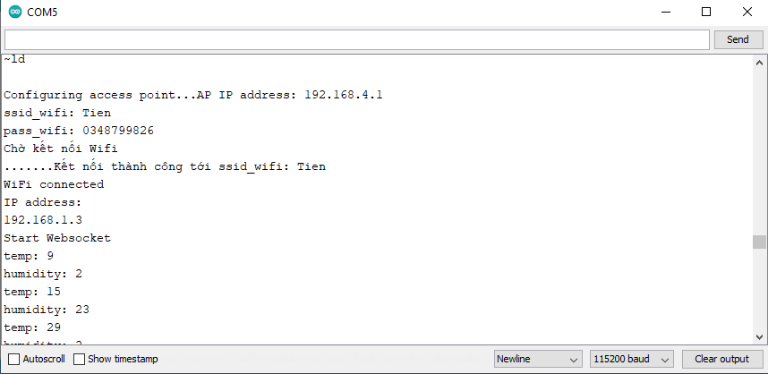
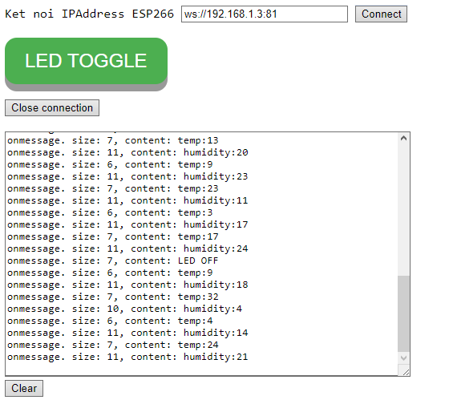
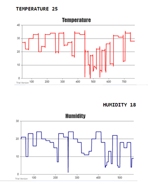

<!-- PROJECT LOGO -->
<br />
<p align="center">
  <h1 align="center">Websocket Server ESP8266</h1>
  
  

<!-- TABLE OF CONTENTS -->
<details open="open">
  <summary>Table of Contents</summary>
  <ol>
    <li>
      <a href="#about-the-project">About The Project</a>
      <ul>
        <li><a href="#overview">Overview</a></li>
		<li><a href="#expected-behavior">Expected Behavior</a></li>
		<li><a href="#project-structure">Project Structure</a></li>
      </ul>
    </li>
	<li><a href="#comments">Comments</a></li>
    <li><a href="#contact">Contact</a></li>
    <li><a href="#references">References</a></li>
  </ol>
</details>


<!-- ABOUT THE PROJECT -->
## About The Project

### Overview
Build the websocket server on Esp8266. Simulate data to be sent from websocket server to websocket client, by approaching the button on websocket client to control Led built-on Esp8266.<br>
Components used:<br>
* Esp8266
### Expected Behavior
<p>
Run the code on the esp8266 using the Arduino IDE. Open the dangnhap.html file to login to wifi and wait a few seconds for the esp8266 to be really ready.
<p align="center">
  
  
</p>
Open file wsk_client.html and connect to IP Adress of Esp8266. After the connection succeeds, a simulated data from device.cpp will be sent to Esp8266 and displayed.
<p align="center">
  
  
</p>


### Project Structure

```
├── README.md              	: Description of project
├── images              	: Folder contains images of project
      ├── chart.png
      ├── espweb1.jpg
      ├── espweb2.jpg
      ├── espweb3.jpg
├── data
      ├── dangnhap.html     : Page connect wifi for Esp8266
      ├── device_chart.js
      ├── device_main_chart.js
      ├── wsk_client.html   : Websocket client communicate with Esp8266
      ├── xuliketnoi.js
├── WebServer.ino		: Sensor library
├── device.h        : Simulate value from sensor
├── device.cpp

```

<!-- GETTING STARTED -->
## Comments
This project was built in Arduino IDE.

<!-- CONTACT -->
## Contact

Author - [PHAM NGUYEN QUOC HUNG](https://hun9pham.github.io) - hungpham99er@gmail.com

Project Link: [Souce code](https://github.com/hun9pham/websocket-server-esp8266.git)

## References
